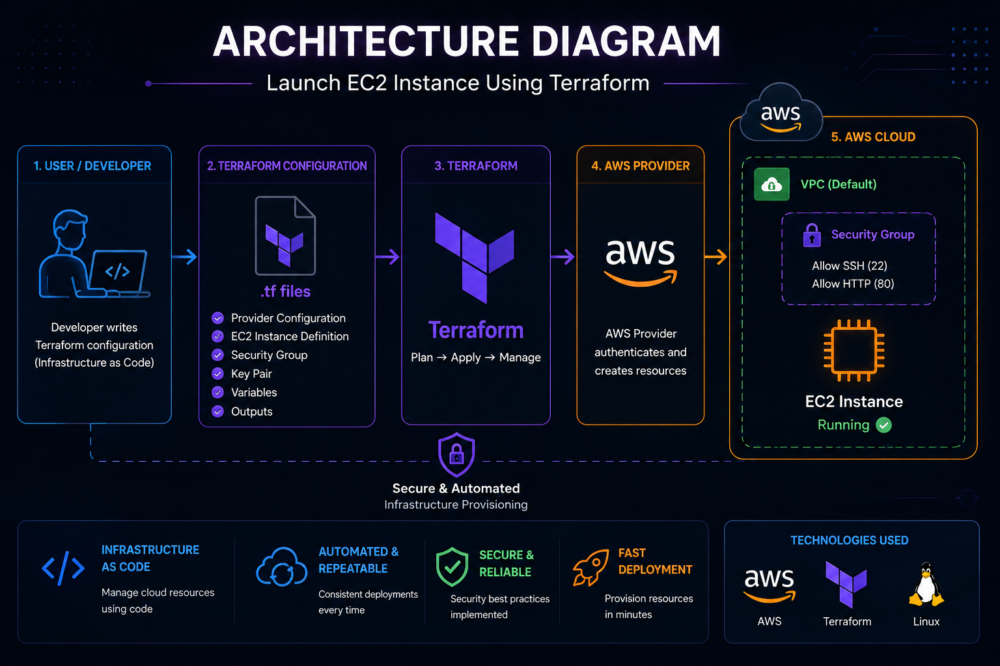
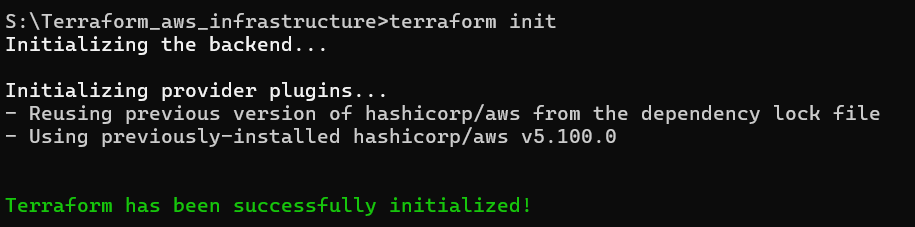
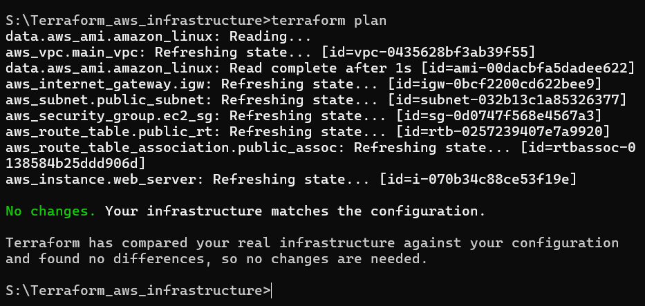
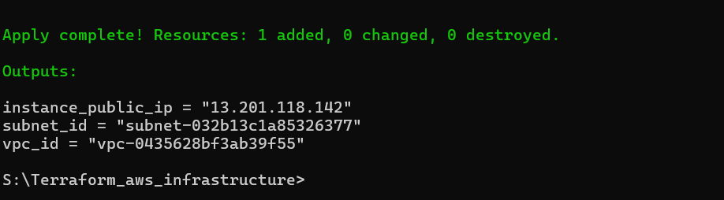
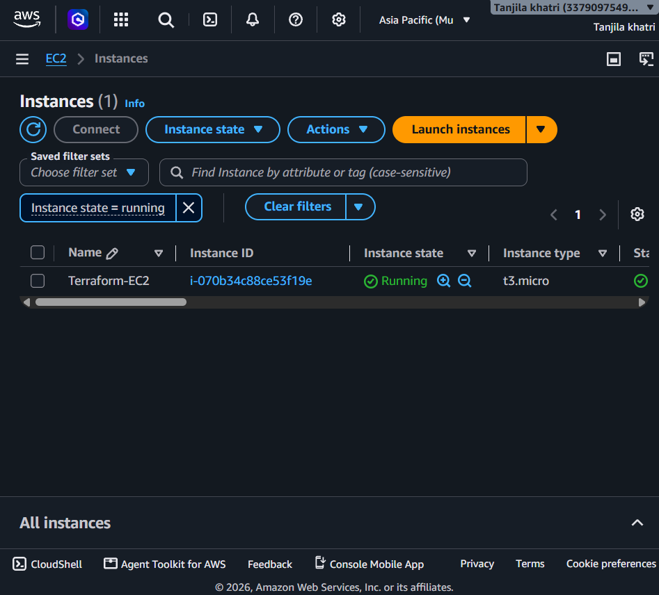

# 🚀 Launch EC2 Instance Using Terraform

<p align="center">


</p>

## 📌 Project Status

✅ Completed

This project successfully demonstrates the deployment of an Amazon EC2 instance on AWS using Terraform Infrastructure as Code (IaC).

<p align="center">
  
</p>

## 🏗️ Architecture

<p align="center">
  
</p>

---

## 📑 Table of Contents

- [📖 Project Overview](#-project-overview)
- [🎯 Objectives](#-objectives)
- [🏗️ Architecture Diagram](#️-architecture-diagram)
- [🛠️ Technologies Used](#️-technologies-used)
- [☁️ AWS Services Used](#️-aws-services-used)
- [📂 Project Structure](#-project-structure)
- [⚙️ Terraform Workflow](#️-terraform-workflow)
- [✨ Features](#-features)
- [📸 Project Screenshots](#-project-screenshots)
- [📚 Learning Outcomes](#-learning-outcomes)
- [🚀 Future Enhancements](#-future-enhancements)
- [👩‍💻 Author](#-author)

---

## 🔄 Project Workflow

```text
Developer
    │
    ▼
Terraform Configuration Files (.tf)
    │
    ▼
Terraform Commands
(terraform init → plan → apply)
    │
    ▼
AWS Provider
    │
    ▼
Amazon EC2 Instance
```

## 📖 Project Overview

This project demonstrates how to provision an Amazon EC2 instance on AWS using **Terraform**, an Infrastructure as Code (IaC) tool. Instead of manually creating cloud resources through the AWS Management Console, the infrastructure is defined in Terraform configuration files, making the deployment process automated, repeatable, and efficient.

This project helped me gain practical experience with cloud infrastructure automation, Terraform workflow, and AWS resource management.

---

## 📌 Project Summary

| Feature | Details |
|---------|---------|
| Cloud Provider | Amazon Web Services (AWS) |
| Service | Amazon EC2 |
| IaC Tool | Terraform |
| Region | ap-south-1 |
| Instance Type | t2.micro |
| Operating System | Linux |
| Version Control | Git & GitHub |

## 🎯 Objectives

- Automate the creation of an Amazon EC2 instance using Terraform.
- Learn the fundamentals of Infrastructure as Code (IaC).
- Configure AWS resources through Terraform.
- Understand the Terraform deployment lifecycle.
- Gain hands-on experience with AWS cloud services.

---

## 🛠️ Technologies Used

| Category | Technology |
|----------|------------|
| Cloud Platform | Amazon Web Services (AWS) |
| Compute Service | Amazon EC2 |
| Infrastructure as Code | Terraform |
| Version Control | Git & GitHub |
| Operating System | Linux |
| CLI Tool | AWS CLI |
---

## ☁️ AWS Services Used

### Amazon EC2 (Elastic Compute Cloud)

Amazon EC2 provides scalable virtual servers in the AWS Cloud. In this project, Terraform automatically provisions an EC2 instance with the required configuration.

---

## 📂 Project Structure

```
Launch-EC2-Using-Terraform/
│
├── provider.tf
├── main.tf
├── variables.tf
├── outputs.tf
├── terraform.tfvars
├── .gitignore
├── README.md
└── screenshots/
```

---

## 📋 Prerequisites

## 🚀 Installation / Getting Started

### 1. Clone the Repository

```bash
git clone https://github.com/tanjilakhatri/Terraform-EC2-Deployment.git
```

### 2. Navigate to the Project Directory

```bash
cd Terraform-EC2-Deployment
```

### 3. Configure AWS Credentials

```bash
aws configure
```

### 4. Initialize Terraform

```bash
terraform init
```

### 5. Review the Execution Plan

```bash
terraform plan
```

### 6. Deploy the Infrastructure

```bash
terraform apply
```

Type **yes** when prompted.

### 7. Verify the EC2 Instance

Open the AWS Management Console and confirm that the EC2 instance has been created successfully.

### 8. Destroy the Infrastructure (Optional)

```bash
terraform destroy
```
## ⚙️ Terraform Workflow

### 1. Configure AWS Credentials

```bash
aws configure
```

Provide:

- AWS Access Key ID
- AWS Secret Access Key
- Default Region

---

### 2. Initialize Terraform

```bash
terraform init
```

This command initializes the working directory and downloads the required Terraform providers.

---

### 3. Validate Configuration

```bash
terraform validate
```

This checks the Terraform configuration for syntax and configuration errors.

---

### 4. Review Execution Plan

```bash
terraform plan
```

This command displays the infrastructure changes Terraform will make before deployment.

---

### 5. Deploy Infrastructure

```bash
terraform apply
```

Terraform creates the EC2 instance automatically.

---

### 6. Verify the EC2 Instance

After deployment, log in to the AWS Management Console and verify that the EC2 instance is running successfully.

---

### 7. Destroy Resources

```bash
terraform destroy
```

This command removes the infrastructure created by Terraform.

---

## 📤 Output

After successfully executing the Terraform configuration, the following resources are created:

- ✅ Amazon EC2 Instance
- ✅ Public IPv4 Address
- ✅ Instance ID
- ✅ Running EC2 Instance in the AWS Management Console

The output values can be viewed using:

```bash
terraform output
```

You can also verify the deployed instance by navigating to the **Amazon EC2 Console** in your AWS account.

## ✨ Features

- 🚀 Automated EC2 Instance Deployment
- ⚙️ Infrastructure as Code using Terraform
- ☁️ AWS Cloud Resource Provisioning
- 🔄 Repeatable and Consistent Deployments
- 🔒 Secure Configuration Management
- 📄 Simple and Well-Organized Terraform Code
- 📦 Version Controlled with Git and GitHub

---

## 🔒 Security Practices

- AWS credentials are configured using AWS CLI.
- Sensitive files are excluded using `.gitignore`.
- SSH access is secured using an AWS Key Pair.
- Security Groups control inbound and outbound traffic.
- Infrastructure is managed through Terraform configuration files.

---

## 📸 Project Screenshots

### 🔹 Terraform Initialization

Terraform successfully initialized the working directory.



---

### 🔹 Terraform Plan

Terraform generated the execution plan before creating resources.



---

### 🔹 Terraform Apply

Terraform successfully provisioned the Amazon EC2 instance.



---

### 🔹 EC2 Instance Running

The EC2 instance is running successfully in the AWS Management Console.



## 📚 Learning Outcomes

Through this project, I learned:

- Infrastructure as Code (IaC)
- Terraform configuration files
- Terraform commands and workflow
- AWS EC2 provisioning
- AWS provider configuration
- Cloud infrastructure automation
- Version control with Git and GitHub

---

## ⚠️ Challenges Faced

- Understanding Terraform syntax
- Configuring AWS credentials
- Selecting the correct AMI
- Managing Terraform state
- Troubleshooting deployment errors
- Understanding the Terraform execution workflow

---

## 🚀 Future Enhancements

- Deploy multiple EC2 instances
- Create a custom VPC using Terraform
- Automate Security Group creation
- Add Elastic IP support
- Use Terraform Modules
- Deploy applications on the EC2 instance
- Integrate CI/CD using GitHub Actions or Jenkins

---

## 🎓 Conclusion

This project demonstrates the practical implementation of Infrastructure as Code by automating the deployment of an Amazon EC2 instance using Terraform. It highlights how cloud infrastructure can be managed efficiently through code, making deployments faster, more reliable, and easier to maintain.

---

## 👩‍💻 Author

### Tanjila Khatri

**B.Tech – Computer Science Engineering**
**Aspiring Cloud Engineer | AWS | Terraform | Linux | Git | GitHub**


### Connect with Me

- GitHub: https://github.com/tanjilakhatri
- LinkedIn: https://www.linkedin.com/in/Tanjilakhatri/


---

If you found this project helpful, please consider giving it a ⭐ on GitHub.

### Technical Skills

- Amazon Web Services (AWS)
- Terraform
- Linux
- Git & GitHub
- Python
- Infrastructure as Code (IaC)

---

⭐ **If you found this project useful, don't forget to give it a Star!**
